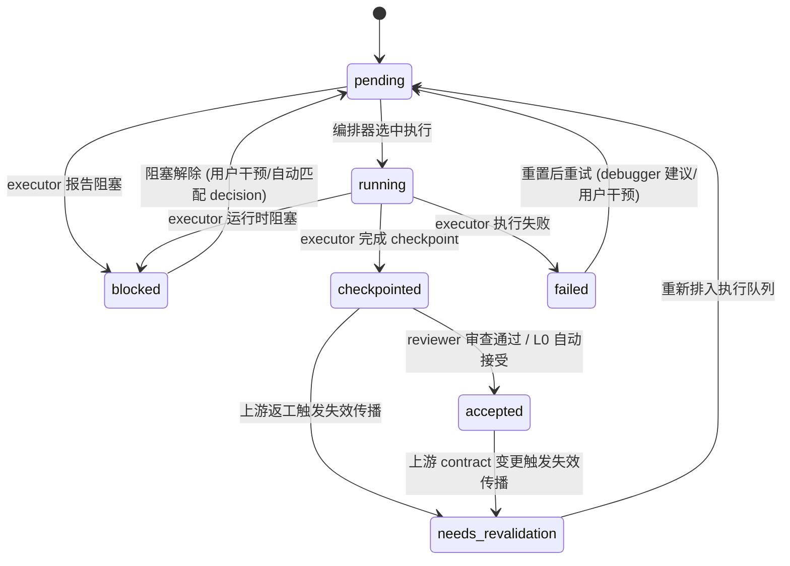
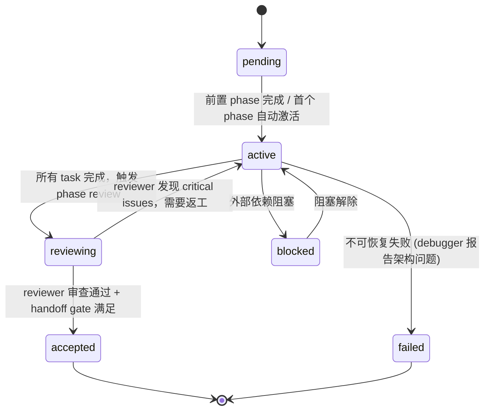
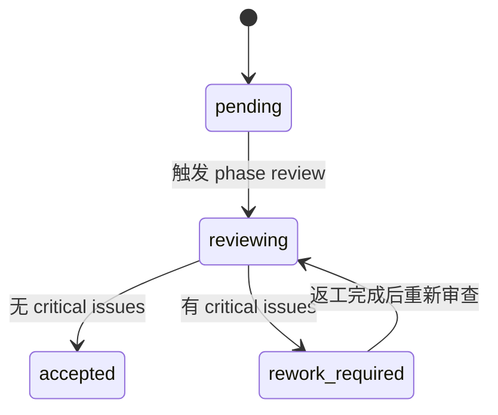
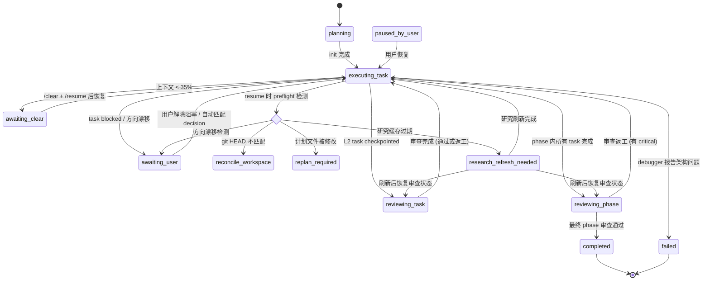

# 状态机图参考

## 1. Task 生命周期

### 状态转换表

| 当前状态 | 允许的目标状态 |
|----------|---------------|
| `pending` | `running`, `blocked` |
| `running` | `checkpointed`, `blocked`, `failed` |
| `checkpointed` | `accepted`, `needs_revalidation` |
| `accepted` | `needs_revalidation` |
| `blocked` | `pending` |
| `failed` | `pending` |
| `needs_revalidation` | `pending` |

### Mermaid 图



### 关键路径说明

- **正常路径**: `pending -> running -> checkpointed -> accepted`
- **阻塞路径**: `pending -> blocked -> pending -> running` (解除阻塞后重入)
- **失败-重试路径**: `running -> failed -> pending -> running` (retry_count 递增)
- **返工路径**: `accepted -> needs_revalidation -> pending -> running` (contract 变更触发)
- **审查返工**: `checkpointed -> needs_revalidation -> pending -> running` (reviewer 要求返工)

来源: `TASK_LIFECYCLE` in `src/schema.js`

---

## 2. Phase 生命周期

### 状态转换表

| 当前状态 | 允许的目标状态 |
|----------|---------------|
| `pending` | `active` |
| `active` | `reviewing`, `blocked`, `failed` |
| `reviewing` | `accepted`, `active` |
| `accepted` | *(终态，无后续转换)* |
| `blocked` | `active` |
| `failed` | *(终态，无后续转换)* |

### Mermaid 图



### 关键路径说明

- **正常路径**: `pending -> active -> reviewing -> accepted`
- **返工路径**: `active -> reviewing -> active -> reviewing -> accepted` (最多循环)
- **失败路径**: `active -> failed` (终态，不可恢复)
- **Phase 推进**: 当前 phase `accepted` 后，下一个 `pending` phase 自动转为 `active`

来源: `PHASE_LIFECYCLE` in `src/schema.js`

---

## 3. Phase 审查状态

### 允许的状态值

```
pending -> reviewing -> accepted
                    \-> rework_required
```

| 状态 | 含义 |
|------|------|
| `pending` | 初始状态，尚未开始审查 |
| `reviewing` | 审查进行中 |
| `accepted` | 审查通过 |
| `rework_required` | 审查发现 critical issues，需要返工 |

### Mermaid 图



### 与 Phase Lifecycle 的关系

- `phase_review.status` 是 phase 对象内的子状态
- `phase_review.retry_count` 记录审查返工次数: 无 critical 时重置为 0，有 critical 时递增
- `handleReviewerResult` 中: 有 critical -> `rework_required`; 无 critical -> `accepted`
- 审查 accepted 且 scope 为 phase 时，同时设置 `phase_handoff.required_reviews_passed = true`

来源: `PHASE_REVIEW_STATUS` in `src/schema.js`, `handleReviewerResult()` in `src/tools/orchestrator.js`

---

## 4. Workflow Mode 状态机

### 所有模式

| 模式 | 含义 |
|------|------|
| `planning` | 计划阶段 |
| `executing_task` | 正在执行 task |
| `reviewing_task` | L2 task 即时审查中 |
| `reviewing_phase` | L1 phase 批量审查中 |
| `awaiting_clear` | 上下文不足，等待 /clear |
| `awaiting_user` | 等待用户干预 (阻塞/方向漂移) |
| `paused_by_user` | 用户主动暂停 |
| `reconcile_workspace` | git HEAD 不匹配，需要工作区协调 |
| `replan_required` | 计划文件被外部修改，需要重新规划 |
| `research_refresh_needed` | 研究缓存过期，需刷新 |
| `completed` | 所有 phase 完成 (终态) |
| `failed` | 工作流失败 (终态) |

### Mermaid 图 (主要转换)



### 关键转换说明

**执行主路径**:
`planning -> executing_task -> reviewing_phase -> executing_task (next phase) -> ... -> completed`

**L2 审查分支**:
`executing_task -> reviewing_task -> executing_task`

**上下文耗尽路径**:
`executing_task -> awaiting_clear -> executing_task` (需要 /clear + /resume)

**Preflight 覆盖 (resume 时检测)**:
`resumeWorkflow()` 执行 `evaluatePreflight()` 检测以下条件 (按优先级):
1. git HEAD 不匹配 -> `reconcile_workspace`
2. 计划文件被外部修改 -> `replan_required`
3. 方向漂移 -> `awaiting_user`
4. 研究缓存过期 -> `research_refresh_needed`

**Research 刷新后恢复**:
`storeResearch()` 中: 如果 `workflow_mode === 'research_refresh_needed'`，调用 `inferWorkflowModeAfterResearch()` 根据 `current_review` 状态推断恢复到 `reviewing_phase` / `reviewing_task` / `executing_task`。

来源: `WORKFLOW_MODES` in `src/schema.js`, `resumeWorkflow()`, `evaluatePreflight()` in `src/tools/orchestrator.js`, `storeResearch()` in `src/tools/state/`
